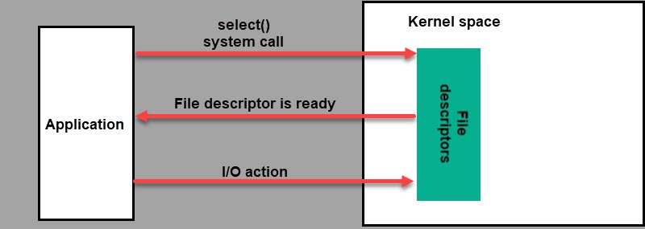

# Groking async in Python: various examples

## "select" async

- `select_async.py`
- `output.txt`

Based on OS's `select` call via standart Python's `select` module
https://en.wikipedia.org/wiki/Select_(Unix)

The example from the repository does the following - we create some kind of event loop, and also add handles that we want to monitor using `select()`.

In our case, two descriptors are monitored - standard input (`stdin`) and reading from pipe.

All output is written to a .txt file.

- Open `select_async.txt` in tab
- Launch `select_async.py`
- `simulate_external_input()` will start to write into `.txt` file. Try to type something in terminal (`stdin`), `simulate_external_input()` will not block thread of execution.

## "selector" async

- `selector_async.py`
- `output.txt`

High-level I/O API with same principle as `select` module https://docs.python.org/3/library/selectors.html

Concrete implementation of default select mechanism depends on OS (`epoll` for UNIX by default)

Example in repo do almost same things as `select` example, but we need to register descriptors via selector object `.register()` method and in event loop we will read registered events
